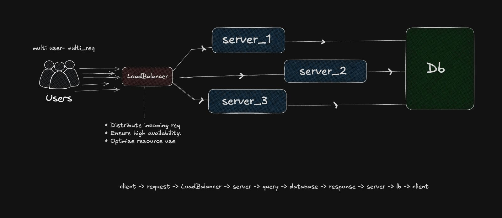

Imagine you have built an amazing web application. When the application is small, having 50 users is manageable; a single server handles this with ease.
But suddenly, your app goes viral.
You now have 50,000 users trying to access the site simultaneously. That single server, once efficient, slowly becomes a bottleneck. The CPU spikes, RAM fills up, and your users start seeing "Connection Timed Out" errors.

The "Multiple Server" Trap: 
To overcome this, you decide to introduce multiple servers. It seems like a good move, but soon you realize your app is still slow.
Why? Because you likely implemented a simple failover list (placing servers in an array).

* The Flaw: In this setup, traffic defaults to Server A. Only if Server A crashes does traffic move to Server B.Server A is still taking 100% of the load while Server B sits idle. You have scaled your hardware, but you haven't scaled your traffic flow.

This is where a Load Balancer comes into the picture.

What is a Load Balancer?
A Load Balancer is a specialized device (hardware) or software (like Nginx or HAProxy) that acts as a "traffic cop." It sits between the clients and your server farm, distributing incoming traffic efficiently across your infrastructure.

Client -> Load Balancer -> [ Server_1, Server_2, Server_3 ] -> `Database`Shutterstock

how it works ,
1. Load balancer Captures the incoming request from the internet.
2. It Uses an algorithm to select the best capable server.
3. Sends the request to that specific server.
4. Relays the server's response back to the client.

 Benefits:
1. High Availability (Redundancy)
If Server 1 fails or crashes, the Load Balancer detects the "dead" pulse and immediately reroutes traffic to Server 2 and Server 3. The user never experiences downtime.

2. True Scalability
Need more power? You can simply add [ Server 4, Server 5 ] to the cluster. The Load Balancer will automatically start sending them traffic.

3. Enhanced Performance
Because traffic is distributed evenly, no single server is overwhelmed. This leads to faster response times and significantly lower latency.