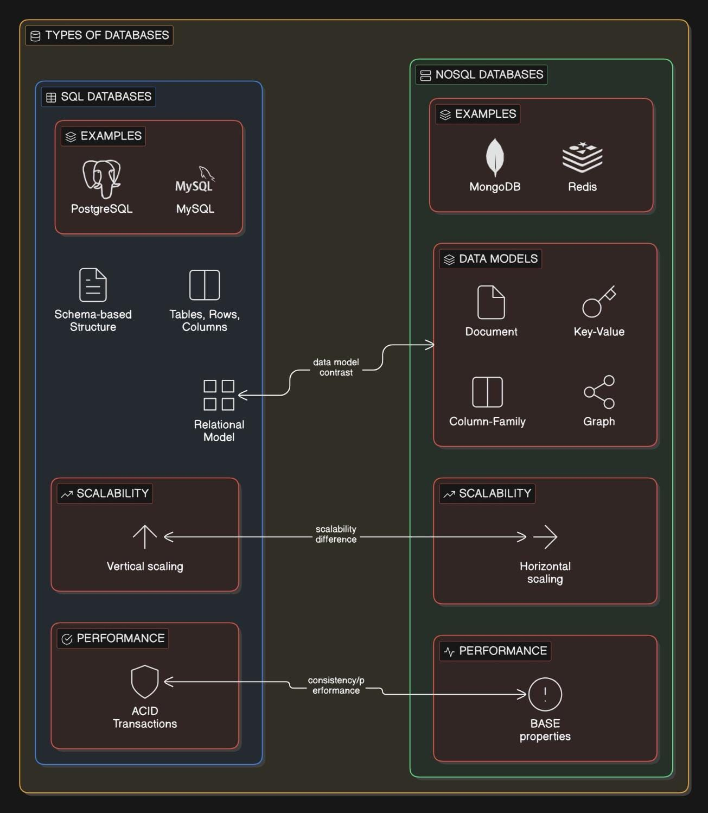

Everyone starts with the question “SQL or NoSQL?” but that question itself is a beginner trap. 

A system designer never picks a database first, they pick a failure they are willing to accept. That one idea alone separates students from engineers who design systems that actually survive production traffic.

Imagine you’re building a college ERP system. Student marks, fees, attendance, and exam results. If a student pays fees and the payment succeeds but the record is not stored, that’s unacceptable. Even one wrong entry is a disaster. This is where SQL databases live comfortably. Structured tables, fixed schema, strong rules, foreign keys, and ACID transactions (will cover this in next post) make sure the system never enters a half-broken state. Either everything is saved or nothing is. Accuracy beats speed here, every single time.

Now shift your brain to Instagram. A user uploads a post, another user likes it, ten thousand users like it within a second. If one like appears one second late on someone’s phone, nobody complains. If the app goes down for five seconds, that’s a bigger problem than missing a single like. This is the natural home of NoSQL. Flexible data, fast writes, horizontal scaling, and eventual consistency. Data may sync slightly later, but the system stays alive under massive load.

Here’s the mistake many beginners make. They compare SQL and NoSQL like programming languages. That’s wrong. They solve different failure scenarios. SQL protects you from incorrect data. NoSQL protects you from traffic spikes.

Let’s take a real-world example. Amazon does not choose one. Product catalog, recommendations, browsing history, user sessions are stored in NoSQL because speed and availability matter more than perfect accuracy. Orders, payments, refunds, invoices live in SQL because even a single incorrect transaction can cost millions and break trust. Same company, same users, two different database philosophies working together.

Another system design insight most people miss. NoSQL is not “schema-less”, it is “schema-on-read”. You still design structure, just in your application instead of the database. That’s why poor NoSQL design leads to chaos, duplicated data, and unreadable systems. Also NoSQL does not follow ACID properties by default. They follow something called as BASE properties. ( will cover in detail what these are in next post)

SQL, on the other hand, is not “slow”. It’s predictable. At small to medium scale, a well-indexed SQL database can outperform badly designed NoSQL systems. The scaling challenge appears when writes explode and joins become expensive across distributed machines.

So the real question is never SQL vs NoSQL. The real questions are: What happens if data is temporarily inconsistent? What happens if the system goes down? What is more expensive for the business, wrong data or delayed data?

If you can answer those three questions, the database choice becomes obvious.

This mindset shift is what turns students into system designers and senior developers into architects.

Have you made it till here? Drop a ❤️ in the comments so I know this helped.

Happy designing