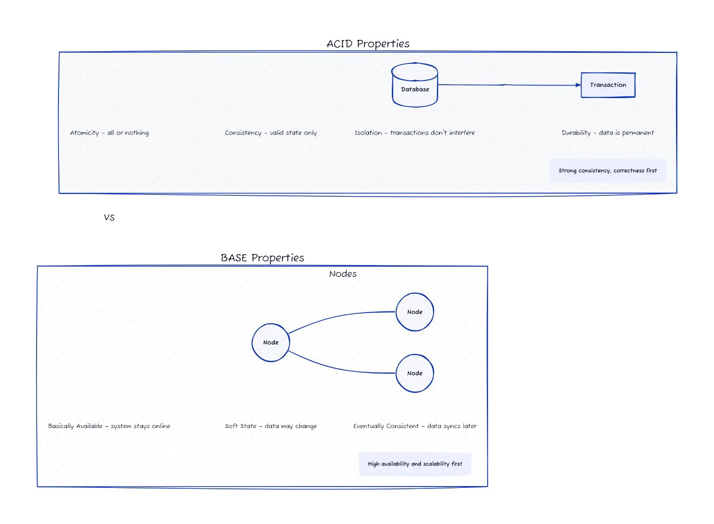

Most people hear ACID and BASE and think they are database “features”. That’s already the wrong mental model. ACID and BASE are not features you turn on or off. They are design philosophies that define how a system behaves when things go wrong - and things always go wrong in production.

Let’s start with ACID, the mindset behind traditional relational databases. ACID stands for Atomicity, Consistency, Isolation, and Durability, but memorizing the expansion is useless unless you understand the promise it makes. ACID systems promise correctness over everything else. When a transaction happens, it must either fully succeed or fully fail. There is no in-between world. If money is debited, it must be credited somewhere else. If a seat is booked, it cannot be double-booked. The system would rather slow down or block than allow incorrect data to exist.

Imagine a banking application. You transfer ₹10,000 from Account A to Account B. If the system crashes after debiting A but before crediting B, that is unacceptable. ACID prevents this exact nightmare. Either both steps happen, or none happen. This is why banks, payment gateways, ERP systems, and billing platforms rely heavily on ACID-compliant databases. Accuracy is not a feature here, it is the business itself.

Now shift your thinking to BASE, which is almost the opposite philosophy. BASE stands for Basically Available, Soft state, Eventually consistent. BASE systems accept a hard truth of distributed systems: when traffic is massive and systems are spread across regions, perfect consistency all the time is expensive. Instead of blocking the system, BASE chooses availability. The system stays responsive, even if the data is temporarily inconsistent.

Think of a social media app. You like a post, but your friend doesn’t see that like immediately. Is that a problem? Not really. But if the app freezes every time it tries to sync likes perfectly across servers, users leave. BASE systems prioritize serving requests quickly, and they allow data to sync over time. The system might be temporarily wrong, but it will eventually become correct.

Here’s where beginners often get confused. They think ACID is “good” and BASE is “bad” or “unsafe”. That’s wrong. BASE is not careless, it is intentional. It is a conscious decision to trade immediate consistency for scalability and availability. In fact, without BASE principles, modern systems like Instagram, WhatsApp, Netflix, and Amazon’s recommendation engine would simply not scale.

Real-world systems don’t pick one blindly. They mix them. Amazon uses ACID for orders, payments, and refunds because money cannot be eventually consistent. But they use BASE for product views, recommendations, wishlists, and browsing history because speed matters more than perfection there. Same system, same users, two different guarantees.

A crucial system design insight many miss is this: ACID reduces the complexity of application logic but increases database responsibility. BASE does the opposite. It simplifies the database but pushes complexity to the application layer. That’s why designing BASE systems without deep thinking leads to bugs, duplicate data, and hard-to-debug issues. Eventual consistency demands discipline.

So the real question is never “ACID or BASE?”. The real questions are: Can my business tolerate temporary inconsistency? Is availability more important than correctness at this moment? What is more expensive, blocking the system or fixing wrong data later?

If you can answer these questions clearly, you are no longer just choosing a database property. You are designing a system that aligns with real-world business failures.

If you read this till the end, drop a 👍 - that mindset shift is the foundation of system design.
Happy designing