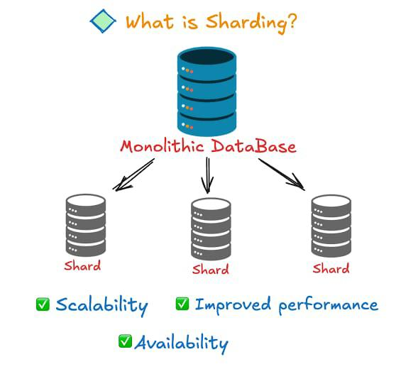

Most people think performance problems start with slow code. System designers know that most performance problems start when one machine is asked to do the job of ten. Sharding is simply the moment you accept that a single database, no matter how powerful, cannot carry the entire system forever.

Imagine you’re building a simple user application. All user data lives in one database. Life is good. Reads are fast, writes are fast, backups are easy. Then the app grows. One million users become ten million. Queries slow down, disk usage explodes, and CPU spikes during peak hours. At this point, adding indexes or upgrading the machine gives temporary relief, but the problem keeps coming back. This is not a tuning problem anymore. It’s a scale problem.

Sharding is the decision to split data across multiple databases so that each one handles only a portion of the total load. Instead of one giant database answering every request, multiple smaller databases share the work. Each database becomes responsible for a specific slice of data, and together they form the complete system.

Think of it like a library. When the number of books is small, one room is enough. When the library grows to millions of books, you don’t buy a bigger room endlessly. You create multiple sections. Each section stores a subset of books, and visitors go directly to the section that has what they need. The total capacity increases, and no single room becomes a bottleneck.

Let’s apply this to a real system. Suppose you are storing user profiles. Instead of placing every user in the same database, you divide users across multiple databases. Each database now stores fewer records, handles fewer queries, and responds faster. Reads and writes are distributed, and traffic spikes no longer crush a single machine.

Here’s where beginners make a critical mistake. They assume sharding automatically makes everything faster. It doesn’t. Sharding solves one problem and introduces new ones. Once data is split, operations that need data from multiple databases become harder. Simple queries that worked earlier now require coordination across shards. The system becomes more powerful, but also more complex.

This is why sharding is not a “Day 1” decision. Early systems prefer simplicity. Sharding appears when growth forces your hand. It’s the point where vertical scaling stops being cost-effective and horizontal growth becomes necessary.

Another important insight: sharding is not about storage alone. It’s about load isolation. When traffic hits one part of the system heavily, only the databases responsible for that data feel the pressure. The rest of the system stays healthy. This is one of the biggest reasons large-scale systems survive sudden traffic spikes.

Real-world platforms use sharding everywhere. User data, orders, messages, logs - all are divided so that no single database becomes a single point of collapse. Without sharding, high-traffic systems would spend more time recovering from outages than serving users.

But sharding comes with responsibility. Data placement decisions become permanent. Moving data later is expensive and risky. That’s why system designers spend a lot of time thinking before splitting data. Sharding too early adds complexity. Sharding too late causes downtime.

So the real question is not “Should I shard?”. The real questions are: Is one database already my bottleneck? Am I scaling hardware just to survive load? Is my system’s growth predictable or explosive?

If you can answer these honestly, sharding stops being a scary concept and becomes a natural evolution of your system.

If you read this till the end, drop a ❤️ , the next post will build on this foundation.
Happy designing